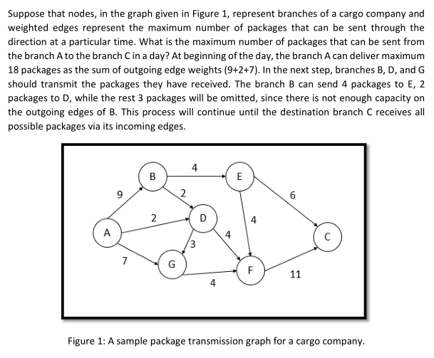

# Max-Flow Min-Cut

- The program was developed to find solutions to the following questions.
- 1- What is the maximum number of packages that can be transferred from source to destination in one day?
- 2- Which edges’ capacity should be increased at first to increase the number of received packages at the destination branch?
- Maximum Flow Minimum Cut Theorem (Ford-Fulkerson Algorithm) was used to solve these questions.
- 3 methods (maxFlowMinCut, bfs, dfs) in Graph class were taken from https://www.geeksforgeeks.org/minimum-cut-in-a-directed-graph/ and updated.

